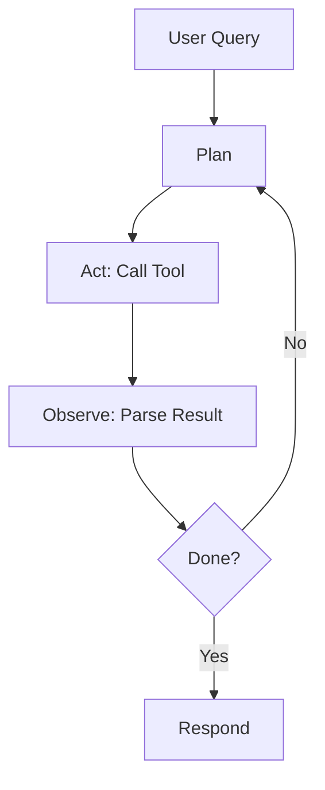

AI agents loop over plan, act, observe, and repeat. They use tools (APIs, calculators, code execution) to accomplish multi-step tasks.



<Tabs>
  <Tab title="LangChain">
    <CodeGroup>
    ```python
    from langchain.agents import create_tool_calling_agent, AgentExecutor
    from langchain_openai import ChatOpenAI
    
    llm = ChatOpenAI(model='gpt-4o')
    tools = [search_tool, calculator_tool]
    agent = create_tool_calling_agent(llm, tools, prompt)
    executor = AgentExecutor(agent=agent, tools=tools)
    result = executor.invoke({'input': 'What is the weather in Paris?'})
    ```
    </CodeGroup>
  </Tab>
  <Tab title="CrewAI">
    <CodeGroup>
    ```python
    from crewai import Agent, Task, Crew
    
    researcher = Agent(role='Researcher', goal='Find accurate facts')
    writer = Agent(role='Writer', goal='Write clear reports')
    task = Task(description='Research X and write a report', agent=researcher)
    crew = Crew(agents=[researcher, writer], tasks=[task])
    crew.kickoff()
    ```
    </CodeGroup>
  </Tab>
  <Tab title="Custom">
    <CodeGroup>
    ```python
    def agent_loop(query):
        messages = [{'role': 'user', 'content': query}]
        while True:
            resp = client.chat.completions.create(
                model='gpt-4o',
                messages=messages,
                tools=[{'type': 'function', 'function': {...}}]
            )
            if not resp.choices[0].message.tool_calls:
                return resp.choices[0].message.content
            for tc in resp.choices[0].message.tool_calls:
                result = call_tool(tc.name, tc.arguments)
                messages.append({'role': 'tool', 'content': str(result)})
    ```
    </CodeGroup>
  </Tab>
</Tabs>

<Warning>
Agents can hallucinate tool results or misuse tools. Validate tool outputs and constrain tool usage (sandbox, limits, approvals).
</Warning>

<Tip>
Design tools to be atomic and deterministic. Return structured data so the model can reason. Avoid tools that mutate critical state without confirmation.
</Tip>

<AccordionGroup>
  <Accordion title="Memory">
    Add conversation memory so agents remember context across turns. Use a vector store or simple sliding window of recent messages.
  </Accordion>
  <Accordion title="Multi-agent systems">
    Split roles: researcher, critic, executor. Coordinate via shared state or message passing. Use a supervisor agent to delegate.
  </Accordion>
</AccordionGroup>

## Next steps

<Columns cols={2}>
  <Card title="Models" icon="brain" href="/guides/ai-ml/models">
    Choose and integrate models.
  </Card>
  <Card title="Prompt engineering" icon="message-bot" href="/guides/ai-ml/prompts">
    Write better prompts.
  </Card>
</Columns>
