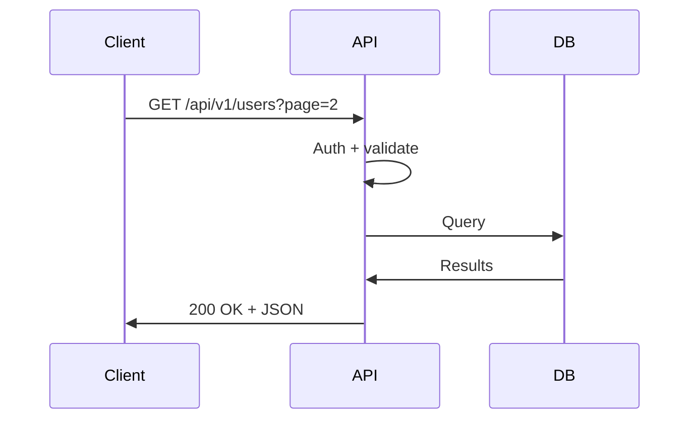

Design REST APIs with consistent naming, clear versioning, and predictable error responses. Follow HTTP semantics and resource-oriented URLs.

| Method | Use when |
|--------|----------|
| GET | Read a resource (idempotent, cacheable) |
| POST | Create a resource or trigger action |
| PUT | Replace a resource (idempotent) |
| PATCH | Partial update (idempotent when same input) |
| DELETE | Remove a resource (idempotent) |

<Tabs>
  <Tab title="URL path">
    `/api/v1/users`, `/api/v1/orders` — most common, cache-friendly.
  </Tab>
  <Tab title="Header">
    `Accept: application/vnd.api+json;version=1` — keeps URLs clean.
  </Tab>
  <Tab title="Query param">
    `/api/users?version=1` — simple but less conventional.
  </Tab>
</Tabs>

<CodeGroup>
```http Endpoint examples
GET    /api/v1/users          # List users
GET    /api/v1/users/:id      # Get single user
POST   /api/v1/users          # Create user
PUT    /api/v1/users/:id      # Replace user
PATCH  /api/v1/users/:id      # Update user
DELETE /api/v1/users/:id      # Delete user
```
</CodeGroup>



<Tip>
Use plural nouns for collections (`/users` not `/user`), kebab-case for multi-word resources (`/order-items`), and nested resources only one level deep: `/users/:id/orders`.
</Tip>

<AccordionGroup>
  <Accordion title="HATEOAS (Hypermedia)">
    Include `_links` in responses pointing to related resources and actions to make the API self-describing.
  </Accordion>
  <Accordion title="Pagination">
    Use `?page=2&per_page=20` or `?cursor=abc123`. Return `X-Total-Count` or `Link` header for total items.
  </Accordion>
</AccordionGroup>

## Next steps

<Columns cols={2}>
  <Card title="Webhooks" icon="webhook" href="/guides/apis/webhooks">
    Implement event-driven integrations.
  </Card>
  <Card title="Rate limiting" icon="gauge-high" href="/guides/apis/rate-limiting">
    Protect APIs with throttling.
  </Card>
</Columns>
