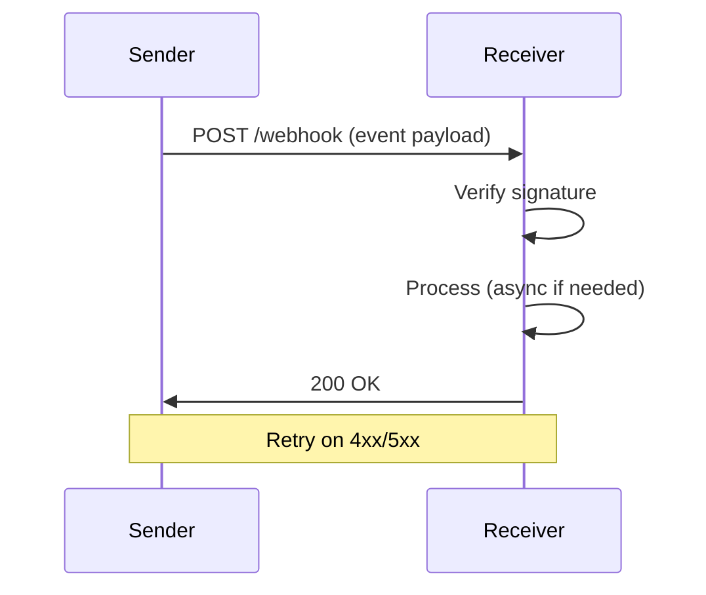

Webhooks deliver events from a sender to your endpoint. Design endpoints that verify signatures, process payloads idempotently, and respond quickly.



<Steps>
  <Step title="Create webhook endpoint">
    Expose a public HTTPS URL that accepts POST requests.
  </Step>
  <Step title="Verify signature">
    Validate the payload using the shared secret and `X-Signature` (or provider-specific header).
  </Step>
  <Step title="Process payload">
    Parse JSON, enqueue for async work if needed, and respond within seconds.
  </Step>
  <Step title="Respond 200">
    Return 200 quickly. Processing can continue in the background.
  </Step>
</Steps>

<CodeGroup>
```javascript Node.js
app.post('/webhook', (req, res) => {
  const sig = req.headers['x-webhook-signature'];
  if (!verifySignature(req.body, sig, process.env.WEBHOOK_SECRET)) {
    return res.status(401).send('Invalid signature');
  }
  queue.add('process-webhook', req.body);
  res.status(200).json({ received: true });
});
```

```php Laravel
Route::post('/webhook', function (Request $request) {
    if (!hash_equals(hash_hmac('sha256', $request->getContent(), config('webhook.secret')), $request->header('X-Signature'))) {
        abort(401);
    }
    ProcessWebhook::dispatch($request->all());
    return response()->json(['received' => true], 200);
});
```
</CodeGroup>

<Warning>
Design for idempotency. Webhooks may be retried multiple times. Use `event_id` or `idempotency_key` to deduplicate before processing.
</Warning>

<Tip>
Implement exponential backoff for your own outbound webhooks. Honor `Retry-After` when providers return it.
</Tip>

<AccordionGroup>
  <Accordion title="Signature verification fails">
    Ensure you hash the raw body, not the parsed JSON. Use the same encoding (UTF-8) as the sender.
  </Accordion>
  <Accordion title="Timeouts and slow processing">
    Return 200 immediately and process in a queue. Blocking for >10s risks retries and provider timeouts.
  </Accordion>
</AccordionGroup>

## Next steps

<Columns cols={2}>
  <Card title="REST API design" icon="sitemap" href="/guides/apis/rest-design">
    Design consistent APIs.
  </Card>
  <Card title="Rate limiting" icon="gauge-high" href="/guides/apis/rate-limiting">
    Protect webhook endpoints.
  </Card>
</Columns>
