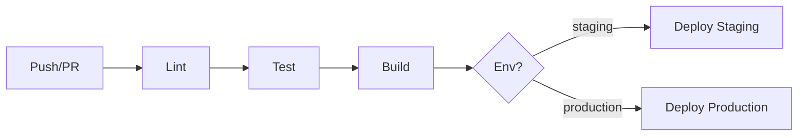

CI/CD pipelines run tests, build artifacts, and deploy on every push or merge. GitHub Actions is a common choice for GitHub-hosted repositories.

<Info>
**Prerequisites:** A GitHub repository, Node.js or your runtime installed in the workflow, and deployment credentials (API keys or tokens) stored as repository secrets.
</Info>

## Pipeline flow



## Setup steps

<Steps>
  <Step title="Create workflow file">
    Add `.github/workflows/ci.yml` to your repository.
  </Step>
  <Step title="Configure triggers">
    Trigger on push and pull requests to `main` and `develop`.
  </Step>
  <Step title="Add test step">
    Install dependencies and run tests (unit, lint, e2e).
  </Step>
  <Step title="Add deploy step">
    Deploy to staging on merge to `develop`, production on merge to `main`.
  </Step>
</Steps>

<CodeGroup>
```yaml .github/workflows/ci.yml
name: CI/CD
on:
  push:
    branches: [main, develop]
jobs:
  test:
    runs-on: ubuntu-latest
    steps:
      - uses: actions/checkout@v4
      - uses: actions/setup-node@v4
        with:
          node-version: "20"
          cache: "npm"
      - run: npm ci
      - run: npm run lint
      - run: npm test
  deploy-staging:
    needs: test
    if: github.ref == 'refs/heads/develop'
    runs-on: ubuntu-latest
    steps:
      - uses: actions/checkout@v4
      - run: echo "Deploy to staging..."
```

```yaml deploy with secret
- name: Deploy
  env:
    DEPLOY_KEY: ${{ secrets.DEPLOY_KEY }}
  run: ./deploy.sh
```
</CodeGroup>

<Warning>Never commit secrets to the repository. Use GitHub **Settings → Secrets and variables → Actions** and reference them as `${{ secrets.SECRET_NAME }}`.</Warning>

<Tip>Use `cache: "npm"` in `actions/setup-node` to cache dependencies and speed up subsequent runs.</Tip>

<AccordionGroup>
  <Accordion title="Tests fail locally but pass in CI" icon="wrench">
    CI uses a fresh environment. Ensure you run `npm ci` (not `npm install`) and that your lockfile is committed. Check for timezone, env vars, and mock differences.
  </Accordion>
  <Accordion title="Deploy step times out" icon="clock">
    Increase `timeout-minutes` in the job. For SSH deployments, verify the key is correct and the server allows GitHub IPs.
  </Accordion>
</AccordionGroup>
