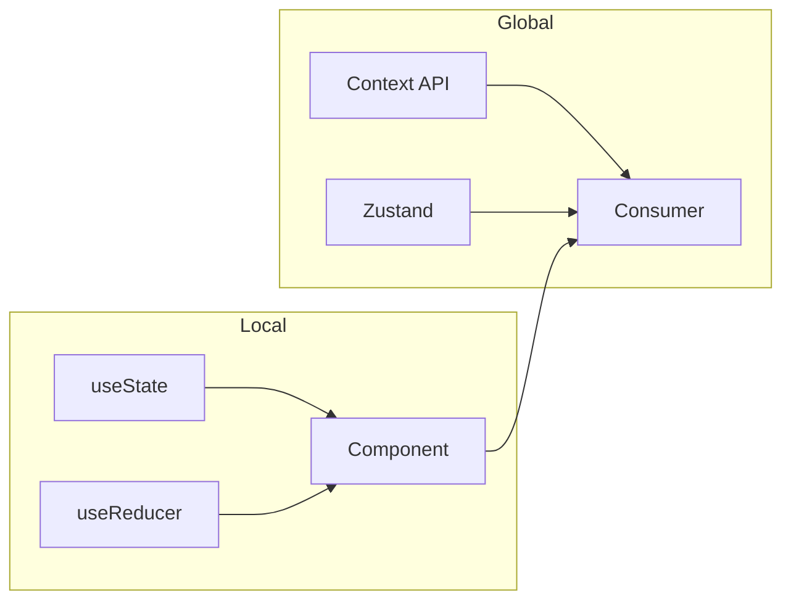

Choose the right tool for your state: local state for component-scoped data, context for app-wide config, external libraries when you need persistence or complex flows.



<Tabs>
  <Tab title="useState">
    <CodeGroup>
    ```tsx
    const [count, setCount] = useState(0);
    setCount(c => c + 1);
    ```
    </CodeGroup>
  </Tab>
  <Tab title="useReducer">
    <CodeGroup>
    ```tsx
    type State = { count: number };
    type Action = { type: 'increment' } | { type: 'reset' };
    const [state, dispatch] = useReducer(reducer, { count: 0 });
    dispatch({ type: 'increment' });
    ```
    </CodeGroup>
  </Tab>
  <Tab title="Context API">
    <CodeGroup>
    ```tsx
    const ThemeContext = createContext<'light' | 'dark'>('light');
    const [theme, setTheme] = useState('light');
    return (
      <ThemeContext.Provider value={theme}>
        <App />
      </ThemeContext.Provider>
    );
    ```
    </CodeGroup>
  </Tab>
  <Tab title="Zustand">
    <CodeGroup>
    ```tsx
    import { create } from 'zustand';
    const useStore = create((set) => ({
      count: 0,
      inc: () => set((s) => ({ count: s.count + 1 })),
    }));
    const { count, inc } = useStore();
    ```
    </CodeGroup>
  </Tab>
</Tabs>

<Tip>
Use `useState` for simple local state, `useReducer` for complex logic, Context for theme/auth that rarely changes, and Zustand when you need shared mutable state without prop drilling.
</Tip>

| Approach    | Best for                           | Complexity |
|------------|------------------------------------|------------|
| useState   | Single component, simple values    | Low        |
| useReducer | Complex state transitions           | Medium     |
| Context    | Theme, locale, auth (read-heavy)    | Medium     |
| Zustand    | Shared mutable state, persistence   | Low        |

## Next steps

<Columns cols={2}>
  <Card title="Components" icon="cubes" href="/guides/react/components">
    Build reusable components.
  </Card>
  <Card title="React setup" icon="react" href="/guides/react/setup">
    Project setup with Vite.
  </Card>
</Columns>
