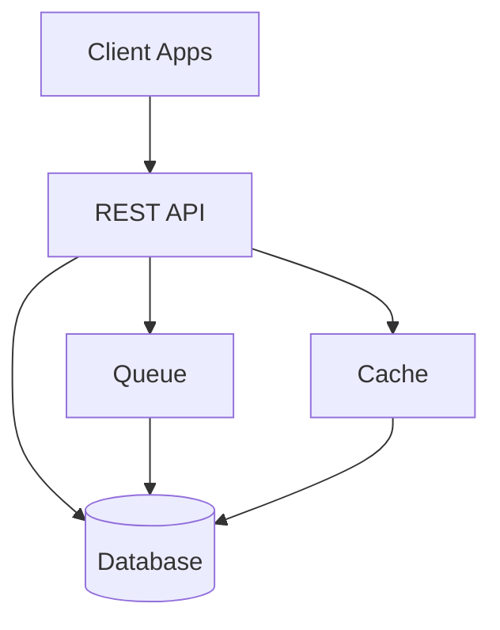

Custojo is a <Tooltip tip="Customer Relationship Management — software for managing interactions with customers and prospects">CRM</Tooltip> platform built for modern sales and support teams. You manage contacts, track deals through a <Tooltip tip="A visual workflow representing stages from lead to closed deal">pipeline</Tooltip>, automate follow-ups, and analyze performance—all through a single API.

<Badge color="green">Active</Badge>

## Architecture

Clients send requests to the Custojo REST API. The API routes operations through a queue for async tasks and a cache for read performance. All data persists in the database.

## Features

<Columns cols={2}>
  <Card title="Contacts" icon="user" href="/products/custojo/api">
    Store and sync contact details, custom fields, and activity history across your tools.
  </Card>
  <Card title="Pipelines" icon="git-branch" href="/products/custojo/api">
    Define deal stages, move opportunities through your workflow, and track conversion rates.
  </Card>
  <Card title="Automation" icon="wand-magic-sparkles" href="/products/custojo/quickstart">
    Trigger actions on contact updates, stage changes, and time-based rules.
  </Card>
  <Card title="Analytics" icon="chart-line" href="/products/custojo/api">
    Pipeline velocity, win rates, and activity dashboards via API or built-in reports.
  </Card>
</Columns>

## Get started

<Columns cols={2}>
  <Card title="Quickstart" icon="rocket" href="/products/custojo/quickstart">
    Set up Custojo and create your first contact in under 5 minutes.
  </Card>
  <Card title="API Reference" icon="code" href="/products/custojo/api">
    Integrate Custojo into your applications via the REST API.
  </Card>
</Columns>
