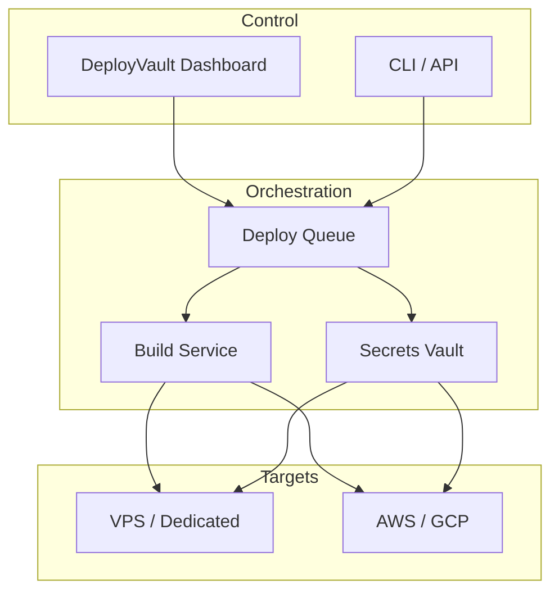

DeployVault manages <Tooltip tip="The process of building, configuring, and releasing applications to servers or cloud environments">deployments</Tooltip> and server orchestration. Connect your servers, define deployment targets, and deploy applications with rollback support and audit logs.

<Badge>New</Badge>

## Architecture

## Features

<Columns cols={2}>
  <Card title="Server management" icon="server" href="/products/deployvault/quickstart">
    Connect SSH servers, configure keys, and group hosts by environment.
  </Card>
  <Card title="Deployments" icon="rocket" href="/products/deployvault/quickstart">
    Deploy from Git, run build commands, and manage release artifacts.
  </Card>
  <Card title="Secrets" icon="key" href="/products/deployvault/quickstart">
    Store API keys and credentials; inject at deploy time without exposing in logs.
  </Card>
  <Card title="Rollbacks" icon="rotate-left" href="/products/deployvault/quickstart">
    One-click rollback to the previous deployment with full audit trail.
  </Card>
</Columns>

## Get started

<Card title="Quickstart" icon="rocket" href="/products/deployvault/quickstart">
  Connect your first server and deploy an application.
</Card>
