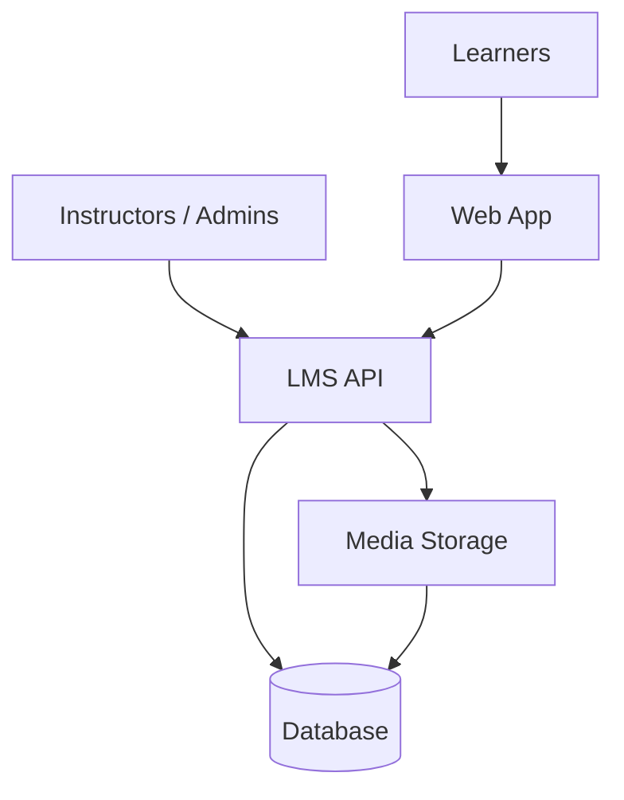

The Zajaly LMS is a <Tooltip tip="Learning Management System — software for creating, delivering, and tracking courses and training">learning management system</Tooltip> for creating and delivering courses. Build <Tooltip tip="Structured learning units containing lessons, quizzes, and assignments">courses</Tooltip>, add modules and lessons, invite learners, and track progress through the API or dashboard.

<Badge color="green">Active</Badge>

## Architecture

Instructors create courses via the API or dashboard. Learners access content through the web app. The API handles authentication, enrollment, progress tracking, and media delivery.

## Features

<Columns cols={2}>
  <Card title="Courses" icon="book-open" href="/products/lms/quickstart">
    Create courses with modules, lessons, and quizzes. Support text, video, and file content.
  </Card>
  <Card title="Enrollment" icon="user-plus" href="/products/lms/quickstart">
    Invite learners by email, manage enrollments, and set access rules.
  </Card>
  <Card title="Progress" icon="chart-simple" href="/products/lms/quickstart">
    Track completion, scores, and time-on-task per learner and course.
  </Card>
  <Card title="Certificates" icon="certificate" href="/products/lms/quickstart">
    Issue completion certificates when learners finish courses.
  </Card>
</Columns>

## Get started

<Card title="Quickstart" icon="rocket" href="/products/lms/quickstart">
  Create your first course and invite learners.
</Card>
