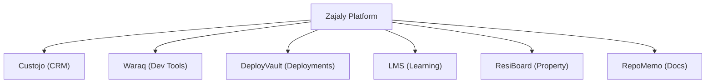

Zajaly builds tools for developers and businesses. Each product has its own documentation, API reference, and SDK.

<Columns cols={2}>
  <Card title="Custojo" icon="users" href="/products/custojo/overview">
    Customer relationship management built for modern teams. <Badge>Active</Badge>
  </Card>
  <Card title="Waraq" icon="code" href="/products/waraq/overview">
    Developer tools for code generation and automation. <Badge color="yellow">Beta</Badge>
  </Card>
  <Card title="DeployVault" icon="server" href="/products/deployvault/overview">
    Deployment management and server orchestration. <Badge color="blue">New</Badge>
  </Card>
  <Card title="LMS" icon="graduation-cap" href="/products/lms/overview">
    Learning management system for courses and training. <Badge>Active</Badge>
  </Card>
  <Card title="ResiBoard" icon="building" href="/products/resiboard/overview">
    Property and residential management platform. <Badge color="gray">Planned</Badge>
  </Card>
  <Card title="RepoMemo" icon="book" href="/products/repomemo/overview">
    Repository documentation and knowledge capture. <Badge color="gray">Planned</Badge>
  </Card>
</Columns>

<Tip>Start with [Custojo](/products/custojo/overview) or [Waraq](/products/waraq/overview) — they have the most complete documentation and API references.</Tip>
