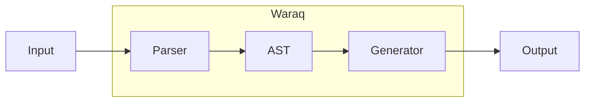

Waraq provides <Tooltip tip="Automated creation of source code, tests, or documentation from specifications or natural language">code generation</Tooltip> and automation tools for developers. Input source code or specs, and Waraq produces structured output using an <Tooltip tip="Abstract Syntax Tree — a tree representation of code structure used for analysis and transformation">AST</Tooltip>-based pipeline.

<Badge color="blue">Beta</Badge>

## Architecture

## Features

<Columns cols={2}>
  <Card title="Code generation" icon="wand-magic-sparkles" href="/products/waraq/quickstart">
    Generate code snippets, tests, and docs from natural language or structured input.
  </Card>
  <Card title="AST analysis" icon="sitemap" href="/products/waraq/sdk">
    Parse and analyze code structure for refactoring, migrations, and lint rules.
  </Card>
  <Card title="Transforms" icon="arrows-rotate" href="/products/waraq/sdk">
    Apply structural changes across files while preserving formatting and semantics.
  </Card>
  <Card title="Templates" icon="file-code" href="/products/waraq/sdk">
    Reusable templates for scaffolding and consistent code style.
  </Card>
</Columns>

## Get started

<Columns cols={2}>
  <Card title="Quickstart" icon="rocket" href="/products/waraq/quickstart">
    Install and configure Waraq for your development workflow.
  </Card>
  <Card title="SDK" icon="puzzle-piece" href="/products/waraq/sdk">
    Integrate Waraq into your applications with the JavaScript and Python SDKs.
  </Card>
</Columns>
